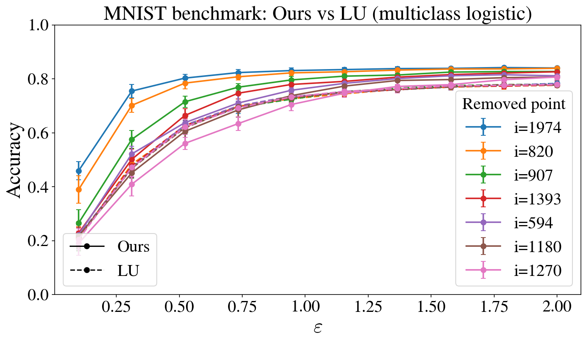

**MNIST benchmark: our per-instance unlearning baseline vs Langevin Unlearning (LU).** 
We compare the two methods on the same **10-class MNIST classification task**, but with **different training objectives**. 

Our method uses a **ridge regression objective with one-hot targets** and predicts the class by argmax over the 10 output coordinates, whereas LU uses its native **multiclass logistic / softmax cross-entropy objective**. 
In addition, LU calibrates a **single noise level** before training, used identically during learning and unlearning and uniformly for deleting any point, whereas our method uses a fixed $\sigma_1$ during learning and then calibrates a specific $\sigma_{\mathrm{unlearn}}$ at deletion time for the particular point to be removed. 

The training set has size $n=2000$, with feature dimension $p=2049$ and output dimension $d=10$. 

For our method, we use $\lambda=10$, $W_0=0$, $T=300$ learning steps, $K=30$ unlearning steps, initial learning noise $\sigma_1=0.01$, and step size $\eta=1/L$, where $L=\lambda_{\max}(X^\top X)+\lambda$; the strong convexity constant is $m=\lambda$. During learning, the unlearning noise is calibrated from our **per-instance sensitivity bound**. 

For LU, we use its native multiclass logistic setup, regularization $\lambda=0.05$, strong convexity $m=\lambda$, Lipschitz constant $M=2$, and step size $\eta=1/(1+\lambda)$, following the stable normalized-feature setting used in the LU implementation (see Table 1 in Appendix M3 in *Langevin Unlearning*, Chien & Al, 2024). 

For both methods, we report the final test accuracy after deleting one point, averaged over **20 trials** for each removed point and each privacy budget $\varepsilon \in \{0.1,\dots,2\}$, with $\delta=1/n$. Solid lines denote our method and dashed lines denote LU; curves with the same color correspond to the same removed point.
