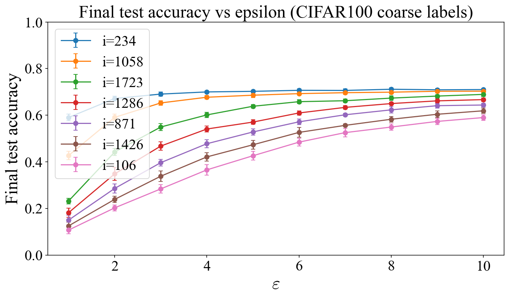

**CIFAR-100 coarse-label benchmark: our per-instance unlearning baseline.**  
We evaluate our method on the **20-class coarse-label version of CIFAR-100**, using a **ridge regression objective with one-hot targets** and predicting the class by **argmax over the 20 output coordinates**.

The plot above shows the **final test accuracy after deleting one point**, as a function of the privacy budget $\varepsilon$, for several removed indices. 

The training set has size $n=2000$, with feature dimension $p=2049$ and output dimension $d=20$.

We use the following parameters:
- ridge regularization $\lambda = 1$,
- initialization $W_0 = 0$,
- $T=500$ learning steps,
- $K=50$ unlearning steps,
- learning noise $\sigma_1 = 0.01$,
- smoothness constant $L=\lambda_{\max}(X^\top X)+\lambda$
- step size $\eta=\frac{1}{L}$
- strong convexity constant $m=\lambda$

For each removed index and each privacy budget $\varepsilon \in \{1,\dots,10\}$, we calibrate the unlearning noise from our **per-instance sensitivity bound** and report the final test accuracy after deletion.

Results are averaged over **10 trials** for each removed point and each value of $\varepsilon$.
